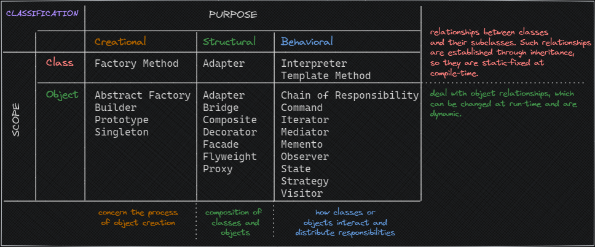

# Introduction

Overview:

- [[#`OO` Software Overview]]
- [[#Design Patterns Basics]]
	- [[#Classification and Relationships]]

---

# `OO` Software Overview

-  **Object-oriented** programs are made up of objects. 
-  An **object** packages both data and the procedures that operate on that data. 
-  The **procedures** are typically called methods or operations. 
-  An **object** performs an operation when it receives a request (or message) from a client. 
-  **Requests** are the only way to get an object to execute an operation. 
-  **Operations** are the only way to change an object's internal data. 
-  Because of these **restrictions**, the object's internal state is said to be encapsulated; it cannot be accessed directly, and its representation is invisible from outside the object.

---

The **design** needs to be: 

-  **specific** to the problem at hand;
-  **general**  enough to address future problems and requirements;
- avoid/minimize **re-design**.

---

> Objet-Oriented Design Principles:
> 1. `Program to an interface, not an implementation.`
> 2. `Favor object composition over class inheritance.`

---

Suggestion from experts: 

<u>reuse solutions that have worked in the past</u>

Main driver: `REUSABILITY`

---

Guidelines for **reusability**:

1. find pertinent objects (real or abstract);
2. factor them into classes at the right granularity;
3. define class interfaces and inheritance hierarchies;
4. establish key relationships among them.

---
## Design Patterns Basics

> "Each pattern describes **a problem which occurs over and over again** in our environment, and then describes the core of the solution to that problem, in such a way that you can use this solution a million times over, without ever doing it the same way twice"  - Christopher Alexander *arch.*

---

What are `DP`s?

 *Descriptions of communicating objects and classes that are customized to solve a general design problem in a particular context*.

> Solutions are expressed in terms of **objects** and **interfaces**.

---

A pattern has `four` essential elements:

- `pattern name`: a handle used to describe a design problem, its solutions, and consequences in few words.
- `problem`: describes when to apply the pattern, it explains the problem and its context.
- `solution`: describes the elements that make up the design, their relationships, responsibilities, and collaborations. Abstract description (not referring to a concrete design/implementation) since a pattern is a template.
- `consequences`: results and trade-off (implementation space and time, reusability, flexibility) of applying the pattern.

---

`DP`s make it easier to reuse successful designs and architectures:

- `DP` names, abstracts, and identifies the key aspects of a common design structure that make it useful for creating a reusable object-oriented design.
- `DP` identifies the participating classes and instances, their roles and collaborations, and the distribution of responsibilities.
- `DP` focuses on a particular object-oriented design problem or issue.
- `DP` describes when it applies, whether it can be applied in view of other design constraints, and the consequences and trade-offs of its use.

---
### Classification and Relationships

Two grouping criteria for classification:

- by purpose
- by scope

---

Classification by **purpose** (what the `DP` does):

- Creational: process of object *creation*;
- Structural: *composition* of class or objects;
- Behavioral: characterization of the ways in which classes or objects *interact and distribute* responsibility.

Classification by **scope** (whether the pattern applies primarily to classes or objects):

- Class: relationships between classes and their subclasses. Relationships established via inheritance, so they are static-fixed at compile-time;
- Object: object relationships, that can be changed at run-time (dynamic).

---

---

How patterns refer to each other:

